# Inference-Time Interventions for Long-Horizon Video Generation: Test-Time Adaptation, Sampling Control, and Sample Selection

May–September 2026 · Last updated 29 September 2026

## Summary

Autoregressive video generators degrade as the generated horizon grows.
Over 30–60 s of chunk-wise generation, frames become over-sharpened,
colour statistics drift, and motion either stalls or degenerates into
temporal flicker. This report studies whether additional computation at
inference time can mitigate this degradation in a frozen generator,
without retraining the underlying model. We report four findings.

- **Sample selection substantially improves long-horizon motion
  without loss of quality.** On a 128-clip, 30 s continuation
  benchmark, Best-of-N seed search [@ma2025inference; @liu2025videot1]
  raises the fraction of clips with non-trivial motion from 32.8% to
  50.8%, with imaging quality and subject consistency unchanged. A
  gated variant, which decides once from the context frames whether a
  clip needs search, retains most of this gain (47.7%) at 17% lower
  cost than searching every clip, and attains the highest imaging
  quality and the lowest FVD of the four systems evaluated
  ([Figure 1](#fig-1)). Roughly one in seven of its newly dynamic
  clips reflects temporal flicker rather than coherent motion, which
  identifies the motion judge as the main remaining target.
- **Long-horizon drift is large, systematic, and measurable.** Over
  ~60 s of self-conditioned generation, mean sharpness increases by
  about 48% and contrast decreases by about 16% relative to the first
  chunk, which makes drift a concrete target for inference-time
  control.
- **Per-video weight adaptation is not the effective lever.** On 1,000
  short video continuations, parameter-space test-time adaptation
  leaves mean PSNR unchanged (17.93 → 17.94 dB), and the same class of
  update does not reduce drift on ~60 s rollouts. This directs effort
  towards the sampling process rather than the weights.
- **Interventions that steer a frozen generator away from its trained
  sampling path trade one failure mode for another.** Edits to the
  denoising trajectory or the attention state either improve subject
  consistency at the expense of motion or reduce imaging quality,
  whereas selection among the generator's own samples does not.

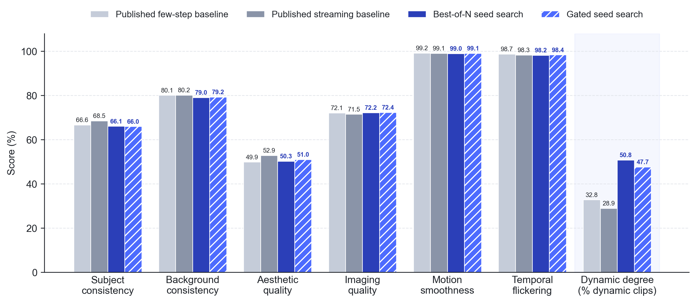{#fig-1}

**Figure 1 |** Full-clip VBench scores on 30 s video continuation (128
clips). The six quality dimensions are medians; Dynamic Degree is the
fraction of clips classified as dynamic. Both seed-search variants
remain within about three points of the published baselines on every
quality dimension while raising the dynamic fraction from 32.8% to
50.8% (Best-of-N) and 47.7% (gated).

---

## 1  Problem setting

Long-form video generation is increasingly evaluated at horizons of
30–60 s and beyond, conditioned either on a text prompt or on a short
observed clip [@huang2025selfforcing; @liu2025rollingforcing;
@yang2025longlive]. At these horizons the dominant failure is rarely a
single corrupted frame. It is a gradual degradation of the
continuation: motion stalls, high-frequency flicker appears, or the
scene content is silently replaced, while per-frame sharpness remains
high or even increases.

We ask whether inference-time computation alone can preserve identity,
motion, and imaging quality in a frozen generator over such horizons.
All interventions studied here leave the pretrained weights of the
foundation model unchanged, except for transient per-video updates
that are discarded after generation.

We evaluate two closely related tasks. In **video continuation**, the
model is conditioned on a few seconds of real context frames and must
generate the unobserved future. In **text-to-video self-continuation**,
generation starts from a prompt and each subsequent chunk is
conditioned on the model’s own earlier output. Both settings are
autoregressive: each chunk is conditioned on previously generated
pixels or on the attention key–value state they produce, so errors can
accumulate across chunks.

**Models and data.** Sections 2 and 3 use LongCat-Video, a
13.6B-parameter diffusion transformer pretrained on video continuation
[@longcat2025]. Sections 4 and 5 use Wan2.1-T2V-1.3B [@wan2025]
distilled into a few-step autoregressive generator with Self Forcing
[@huang2025selfforcing]. Context clips and captions are drawn from
Panda-70M [@chen2024panda70m]; the text-to-video study in Section 5
uses prompts from MovieGen Bench [@polyak2024moviegen].

**Metrics.** Unless stated otherwise, quality is measured with
full-clip VBench [@huang2024vbench; @huang2024vbenchpp], computed
over the entire generated clip. VBench’s Dynamic Degree assigns each
clip a binary motion label; we report it as the fraction of clips
labelled dynamic (equivalently, “living”), not as a median. Pixel-level
metrics (PSNR, SSIM [@wang2004ssim], LPIPS [@zhang2018lpips]) are
computed against the held-out ground truth where it exists. Results
from small studies (n ≤ 8) are reported as feasibility or quality
checks, not as benchmark results.

---

## 2  Parameter-space test-time adaptation

We first studied **parameter-space test-time adaptation (TTA)**: a
small per-video update to the generator, either a global activation
bias or a low-rank adapter [@hu2022lora], optimized on the observed context frames
and kept active while generating the continuation. The underlying
hypothesis, well established in other domains, is that a correction
fitted to the observed portion of a video should transfer to its
unobserved continuation.

On the short in-domain continuation task (N = 1,000), this class of
method does not produce a usable improvement. Always-on adaptation
leaves mean PSNR unchanged (17.93 → 17.94 dB). A higher-capacity
adapter improves aesthetic and motion scores at the expense of imaging
quality (−0.034). The unchanged mean conceals substantial per-video
variance: about one quarter of videos improve by more than 0.1 dB and
about one quarter degrade by more than 0.1 dB. An oracle that applies
adaptation only where it helps gains +0.19 dB, which bounds the value
of a reliable per-video selection rule ([Figure 2](#fig-2)).

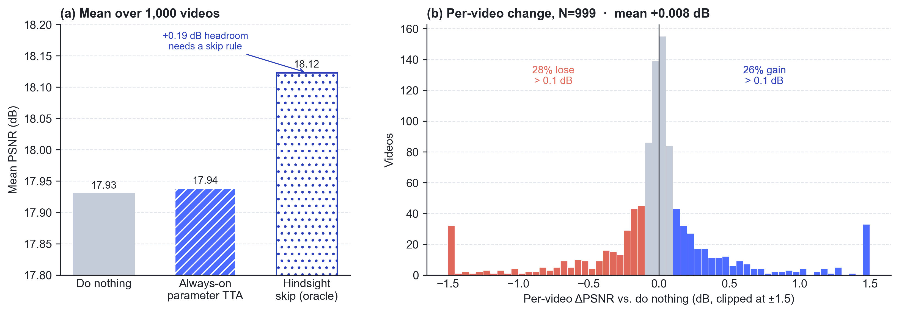{#fig-2}

**Figure 2 |** Short in-domain continuation, 1,000 videos. **(a)**
Always-on parameter-space adaptation leaves mean PSNR unchanged; an
oracle that skips videos it would degrade gains 0.19 dB. **(b)**
Distribution of per-video PSNR change. Gains (blue) and losses (red)
are nearly symmetric, so the null mean reflects cancellation rather
than the absence of an effect.

We attempted to learn such a selection rule from the observed context
alone, using pixel statistics, caption features, compressed-video
features, and the frozen model’s denoising loss on the observed
frames. The model-surprise predictor was anti-correlated with benefit:
videos with low denoising loss gained slightly, whereas high-loss
videos degraded on average (lowest quintile +0.11 dB, highest quintile
−0.13 dB; [Figure 3a](#fig-3)). Every quintile nevertheless contained
large gains and large losses. Routers trained on these features to
choose the adaptation setting for each video recovered at most 3% of
the oracle’s gain out of fold, and most performed worse than a single
fixed setting ([Figure 3b](#fig-3)). A router that appeared effective
on a 200-video pilot reversed sign at N = 1,000.

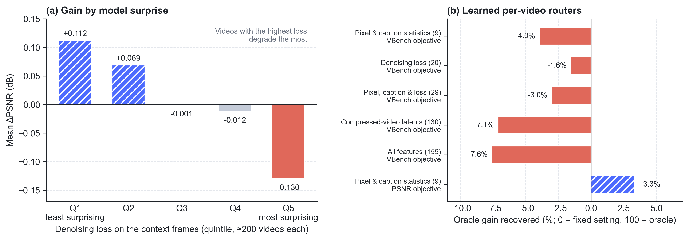{#fig-3}

**Figure 3 |** Predicting which videos benefit from parameter-space
adaptation (1,000 videos). **(a)** Mean PSNR change, stratified by the
frozen model’s denoising loss on the context frames. The videos a
router would most need to correct are those that adaptation degrades.
**(b)** Share of the per-video oracle’s gain recovered, out of fold, by
routers that choose among adaptation settings from features of the
context frames (feature dimension in parentheses). Zero corresponds to
a single fixed setting; the oracle is 100%.

The same class of update also has no measurable effect on long-horizon
autoregressive rollout. Across two update variants and seven drift
signals, no paired test reaches significance (sign-flip p ≥ 0.25;
[Figure 4](#fig-4)), and
every 95% confidence interval either contains zero or indicates
increased drift. A global activation update can shift population-level
statistics, but it does not reduce drift within individual videos.

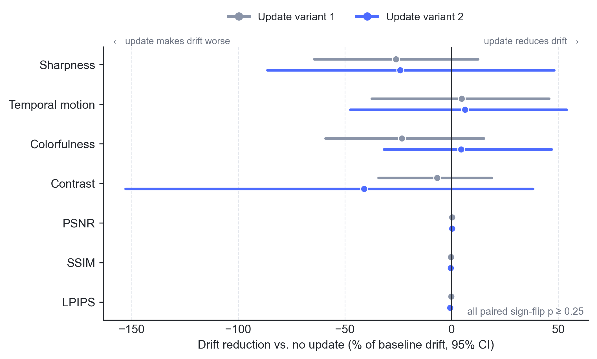{#fig-4}

**Figure 4 |** Drift reduction from a test-time parameter update on
native ~60 s autoregressive rollout (8 videos, paired). Positive values
indicate reduced drift. Intervals are 95% confidence intervals,
expressed as a percentage of the drift without the update.

These observations are consistent with Pathwise Test-Time Correction
[@xiang2026pathwise], which reports that test-time parameter optimization is unstable on
modern video generators because pretrained weights are sensitive to
small perturbations, and which identifies the sampling trajectory as
the more promising point of intervention. Since the base model is
already strong on short in-domain continuation, the remaining
difficulty lies in long-horizon self-conditioning, which per-video
weight updates do not address.

---

## 3  Long-horizon drift and sampling-space interventions

When each chunk is conditioned on the model’s own preceding output,
errors compound with horizon length. On native ~60 s rollouts (N = 8),
mean sharpness increases by about 48% and temporal motion by about 45%
at the final chunk, while contrast decreases by about 16%. The
direction of change is consistent across most videos (sharpness
increases in 6 of 8 and contrast decreases in 7 of 8), although
per-video magnitudes vary widely ([Figure 5](#fig-5)). With eight
videos, the direction of each effect is consistent, but the reported
percentages should be read as indicative rather than precise.
Evaluation at 30 s underestimates the degradation.

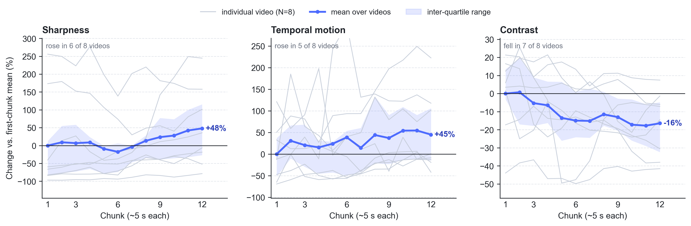{#fig-5}

**Figure 5 |** Drift on native ~60 s autoregressive rollout. Thin lines
show individual videos; the bold line is the mean and the shaded band
the inter-quartile range. All values are relative to the first-chunk
mean.

We therefore turned to **sampling-space interventions**, which keep
the network weights fixed and instead modify the generation process:
selecting among multiple independent samples, restricting or altering
the attention state available to later chunks, or editing the
denoising trajectory within a chunk.

Such interventions typically increase inference cost; Best-of-N
sampling, for example, scales generation time with N. Distillation
offers a way to recover that cost [@yin2024dmd; @yin2024dmd2]: a
student trained under the same sampling procedure can, in principle,
amortize the additional samples into a single forward pass. Section 4
establishes such a sampling-time improvement, which makes distillation
a natural next step.

---

## 4  Results on 30 s video continuation

Our main benchmark is 30 s video continuation on 128 Panda-70M clips.
We compare two published long-horizon systems built on
Wan2.1-T2V-1.3B, the few-step baseline Self Forcing
[@huang2025selfforcing] and the streaming baseline Rolling Forcing
[@liu2025rollingforcing], against **Best-of-N seed search** applied to
Self Forcing: for each chunk after the first, several independent
noise seeds are sampled and the highest-scoring continuation is
retained. Best-of-N sampling is a standard inference-time scaling
technique [@ma2025inference; @liu2025videot1]; we include it because,
on this generator, the random seed has a large effect on whether a
continuation remains dynamic.

Searching every clip is wasteful when the default seed would already
have produced a good continuation. We therefore also evaluate **gated
seed search**: before any frame is generated, a lightweight test on
the context frames decides whether the clip is likely to benefit from
search. If it is not, the clip is generated by the few-step baseline
unchanged; otherwise Best-of-N search is applied to every chunk. On
this benchmark the gate skipped search on 38 of 128 clips (30%).
Implementation details of the gate are omitted here, as the method is
in preparation for publication.

| | Subject consistency | Imaging quality | Dynamic clips | FVD ↓ | Time / clip (s) |
|---|---:|---:|---|---:|---:|
| Published few-step baseline | 0.666 | 72.07 | 32.8% (42 / 128) | 410 | 108 |
| Published streaming baseline | **0.685** | 71.52 | 28.9% (37 / 128) | 436 | **47** |
| Best-of-N seed search | 0.661 | 72.19 | **50.8% (65 / 128)** | 425 | 354 |
| Gated seed search | 0.660 | **72.38** | 47.7% (61 / 128) | **405** | 294 |

Both search variants substantially increase motion without degrading
quality. Best-of-N search raises the fraction of dynamic clips from
32.8% to 50.8%, leaving imaging quality and subject consistency
essentially unchanged. Gated search retains 19 of those 23 additional
dynamic clips while generating 30% of clips at baseline cost, which
reduces mean generation time by 17% relative to Best-of-N. It also
attains the highest imaging quality and the lowest Fréchet Video
Distance (FVD) to the real continuations of the four systems.
Pixel-level reconstruction of the real continuation (PSNR, SSIM,
LPIPS) is unchanged for both variants.

Search remains more expensive than the baseline, at roughly 2.7×
(gated) and 3.3× (Best-of-N) the generation time ([Figure 6](#fig-6)).
These factors are measured wall-clock times on our hardware and
implementation, not lower bounds. The streaming baseline is the
fastest (47 s per clip) and achieves the highest subject consistency,
but has the lowest fraction of dynamic clips, illustrating a trade-off
between identity preservation and motion.

{#fig-6}

**Figure 6 |** Motion versus cost on the 128-clip benchmark. **(a)**
Fraction of dynamic clips against wall-clock time per 30 s clip (log
scale). Gated seed search reaches most of the motion gain of Best-of-N
search at lower cost. **(b)** Wall-clock generation time on our
hardware.

The gain is concentrated in clips that would otherwise stall. Pairing
each clip's Dynamic Degree label under the few-step baseline with its
label under Best-of-N search, 25 clips change from static to dynamic
(e.g., [Figure 10](#fig-10)) and only 2 change from dynamic to static;
the remaining 101 keep their label (40 dynamic, 61 static; e.g.,
[Figure 11](#fig-11)). Under gated search, 20 clips change from static
to dynamic and only 1 changes in the opposite direction. In both cases
the net gain comes almost entirely from static clips that acquire
motion, rather than from a reshuffling of labels.

Per-clip distributions are consistent with this picture
([Figure 7](#fig-7)). Neither search variant shifts the median imaging
quality or subject consistency. Best-of-N search shortens the lower
tail in imaging quality relative to both baselines, whereas the lower
tail in temporal flickering is longer.

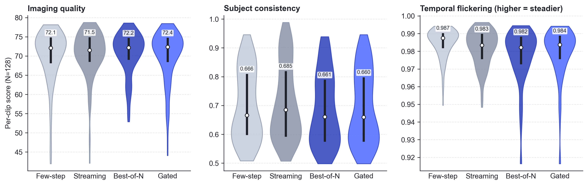{#fig-7}

**Figure 7 |** Per-clip score distributions over the 128 clips. White
markers denote medians; black bars denote inter-quartile ranges.

The longer flickering tail indicates where selection can still
improve. Dynamic Degree is a binary label derived from frame-to-frame
change, and temporal flicker can trigger it. Of the 25 clips that
became dynamic under Best-of-N search, 5 also lost more than 0.02 in
temporal-flickering score ([Figure 8](#fig-8)); under gated search the
corresponding figure is 3 of 20. In the most extreme case, imaging
quality fell by 18 points ([Figure 12](#fig-12)). We report the
official metric unchanged; the large majority of new dynamic labels
reflect motion consistent with the conditioning context, and the
remainder show that a selection criterion able to separate coherent
motion from flicker would convert directly into further gains.
Section 6 examines representative clips visually.

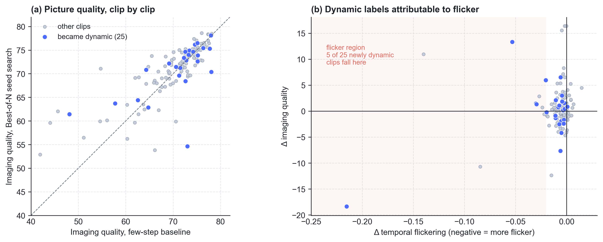{#fig-8}

**Figure 8 |** **(a)** Per-clip imaging quality, few-step baseline
versus seed search; points on the diagonal are unchanged. **(b)**
Change in temporal-flickering score against change in imaging quality.
Blue points are clips that became dynamic under seed search; the
shaded region marks a flickering-score decrease greater than 0.02.

**Other sampling-space interventions clarify why selection works.**
Guiding the continuation towards similarity with the context frames
increases subject consistency but suppresses motion in later chunks:
the context is an informative appearance prior but a poor motion
prior. Permanently retaining early frames in the attention state, an
attention sink [@xiao2024streamingllm] of the kind used by recent
streaming video generators [@liu2025rollingforcing; @yang2025longlive],
likewise improves identity preservation at the cost of motion, the
same trade-off exhibited by the streaming baseline.
Modifying the noise trajectory of a frozen few-step generator either
reduces imaging quality substantially or introduces camera motion
absent from the context. Selecting among samples that the generator
already produces is therefore safe, whereas steering a distilled
generator along trajectories it was not trained on is not. This is
consistent with how Self Forcing and Rolling Forcing are trained, with
the training-time sampling procedure matched to the one used at
inference [@huang2025selfforcing; @liu2025rollingforcing].

---

## 5  Test-time session memory on a frozen generator

We subsequently examined a more specific question. Once early frames
are evicted from a bounded attention window, can a session-local
memory, written during generation of a single video and discarded
afterwards, sustain motion without permanently retaining those early
frames in attention?

Memories of this kind appear in published work, typically in models
trained end-to-end to read from them [@behrouz2024titans;
@dalal2025ttt]. We evaluated the training-free
variant, in which the memory is written at test time while the
few-step generator remains frozen. Quality was again measured with
full-clip VBench.

In a small text-to-video study (8 clips, 30 s), test-time memory
writes failed the quality criterion. Relative to the same generator
without the memory, imaging quality decreased by about 17 points and
subject consistency by about 0.34 ([Figure 9](#fig-9)). All clips were labelled dynamic,
but visual inspection showed temporal flicker rather than motion
consistent with the context. Evicting early frames without writing the
memory left imaging quality essentially unchanged. With eight clips,
this study serves as a quality check rather than a benchmark result,
and we did not extend it to the full benchmark.

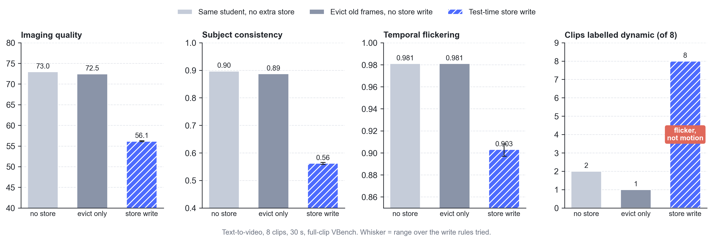{#fig-9}

**Figure 9 |** Quality check for test-time memory on a frozen
generator (text-to-video, 8 clips, 30 s, full-clip VBench). Evicting
early frames alone has negligible effect; writing the session-local
memory at test time reduces imaging quality by about 17 points, and
the resulting dynamic labels reflect flicker.

A related variant, in which the set of later blocks admitted to the
attention cache is modified instead of writing a separate memory, was
discontinued after analysis without a full-scale evaluation. The
published observation remains: permanently retaining the opening
frames improves identity preservation at the cost of motion, and we
have not identified a training-free alternative that preserves both
imaging quality and motion.

These results indicate that this class of intervention is not
effective on a frozen generator. Training a generator so that a
different cache policy is valid at inference time is a substantially
more expensive undertaking.

---

## 6  Qualitative examples

[Figures 10–13](#fig-10) show matched clips from the 128-clip benchmark
as film strips.
Each row corresponds to one system, sampled at eight time points over
the 30 s clip. The first column is real context footage shared by all
rows; the remaining columns are generated. The panel to the left of
each row lists the clip’s full-clip VBench scores, and the trace below
plots frame-to-frame change over the full clip. The few-step baseline
appears in the top row and Best-of-N seed search (labelled
“always-on seed search” in the strips) in the bottom row; Clip D
additionally includes the streaming baseline. The gate fired on all
four clips, so the gated seed search output is identical to the
bottom row.

The four clips were selected to illustrate the per-clip outcomes
described in Section 4 and the flicker effect in [Figure 8](#fig-8):
a static-to-dynamic change that does not prevent degradation
([Figure 10](#fig-10)), a clip that remains static under both systems
([Figure 11](#fig-11)), a dynamic label produced by scene collapse
([Figure 12](#fig-12)), and a clear improvement
([Figure 13](#fig-13)). They are illustrative cases chosen to span
these outcomes, not a random sample.

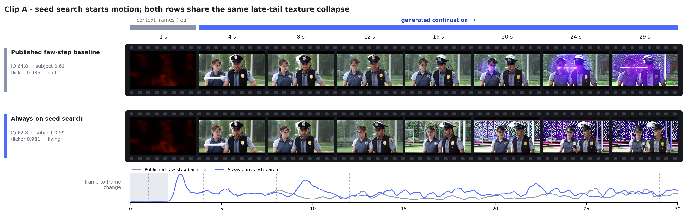{#fig-10}

**Figure 10 |** Clip A: seed search induces motion but does not
prevent degradation. The few-step baseline is labelled static and seed
search dynamic, with most of the additional motion occurring in the
first 10 s. From about 20 s, both rows exhibit the same high-frequency
texture artefacts, and seed search scores about two points lower in
imaging quality. Selection changes which continuation is produced, but
not failure modes shared across seeds.

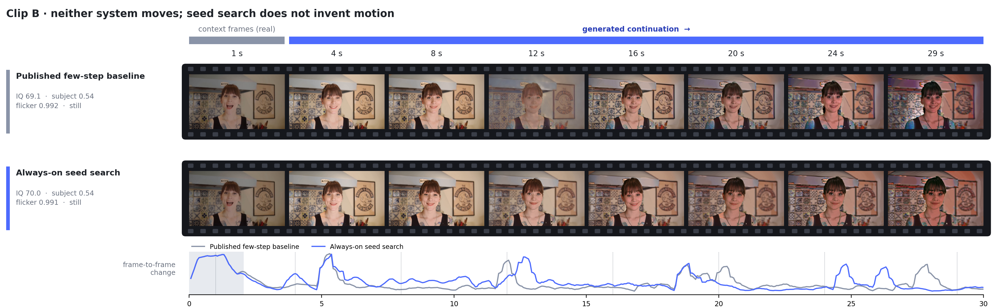{#fig-11}

**Figure 11 |** Clip B: both systems remain static. Seed search does
not introduce motion for every prompt; 61 of 128 clips are static
under both systems. Both rows also show a gradual shift towards warmer
and darker exposure with increasing horizon (compare the 4 s and 29 s
frames).

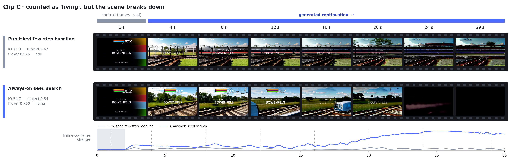{#fig-12}

**Figure 12 |** Clip C: labelled dynamic despite scene collapse. This
is the most extreme case in [Figure 8](#fig-8). Seed search replaces the scene
content (a train enters at about 12–16 s) and then degrades to
near-black frames by 24 s. Its frame-to-frame change increases
steadily, so the clip is labelled dynamic, while imaging quality falls
by 18 points and the temporal-flickering score decreases from 0.975 to
0.760. The few-step baseline preserves the scene, with horizontal
streak artefacts appearing from about 20 s, and is labelled static.

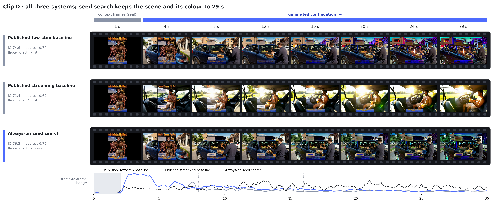{#fig-13}

**Figure 13 |** Clip D: the three systems exhibit distinct failure
modes. By 24–29 s the few-step baseline shows colour artefacts. The
streaming baseline remains sharp but becomes over-exposed and replaces
the subject. Seed search preserves the scene, subject, and colour
through 29 s (imaging quality 76.2, versus 74.6 and 71.4), with its
additional motion concentrated early in the clip. This is the outcome
the benchmark rewards; [Figure 12](#fig-12) shows an outcome it fails to
penalize.

---

## 7  Discussion and future work

The main result of this period is an empirical characterization of
the inference-time intervention space for a frozen, few-step
autoregressive video generator. We examined four points of
intervention — the weights, the denoising trajectory within a chunk,
the attention state carried across chunks, and selection among
independent samples — and evaluated each in terms of full-clip quality
and long-horizon motion.

The clearest positive result is that selection among the generator's
own samples improves long-horizon motion without loss of quality, and
that this gain can be obtained more efficiently. Best-of-N seed search
raises the fraction of dynamic 30 s clips from 32.8% to 50.8%. Gated
seed search, which decides from the context frames alone whether a
clip needs search, retains most of that gain at 17% lower cost and
attains the best imaging quality and FVD among the systems compared.
This shows that the context frames carry usable information about
when additional inference-time computation will pay off, a direction
we intend to develop further.

The remaining interventions sharpen this picture. Parameter-space
test-time updates are ineffective on a saturated short-horizon task
and do not reduce long-horizon drift. Trajectory edits on a frozen
generator, permanent retention of the opening frames, and test-time
memory writes without training either degrade quality or exchange
motion for identity. Together, these results indicate that, for a
frozen distilled generator, the most productive levers are deciding
when to spend computation and choosing among on-distribution samples.

The published literature thus continues to rely on two test-time
mechanisms: **selection among samples** [@ma2025inference;
@liu2025videot1] and **control of the attention cache contents**
[@xiao2024streamingllm; @liu2025rollingforcing; @yang2025longlive].
Both have open problems identified in recent work
[@xiang2026pathwise]:
an inexpensive and temporally reliable quality judge; retention of
content that has left the attention window over intermediate
horizons; and training-free generation at 30 s that preserves both
imaging quality and motion. Our results bear directly on the first
two. The flicker effect in [Figure 8](#fig-8) shows that a judge able
to separate coherent motion from flicker would convert directly into
further gains, and the gated result shows that the decision of when to
search can already be made cheaply from the context frames. Because
selection is the most effective mechanism we found, a student trained
under the same selection procedure could in principle absorb its cost
at training time [@yin2024dmd; @yin2024dmd2], bringing these gains
close to the cost of the base generator.

Our next steps follow from these findings: improving the selection
criterion and the gate, and amortizing search through distillation,
evaluated with the same full-clip metrics on the full benchmark. We
expect this work to form the basis of an academic publication.

---

## References

::: {#refs}
:::
